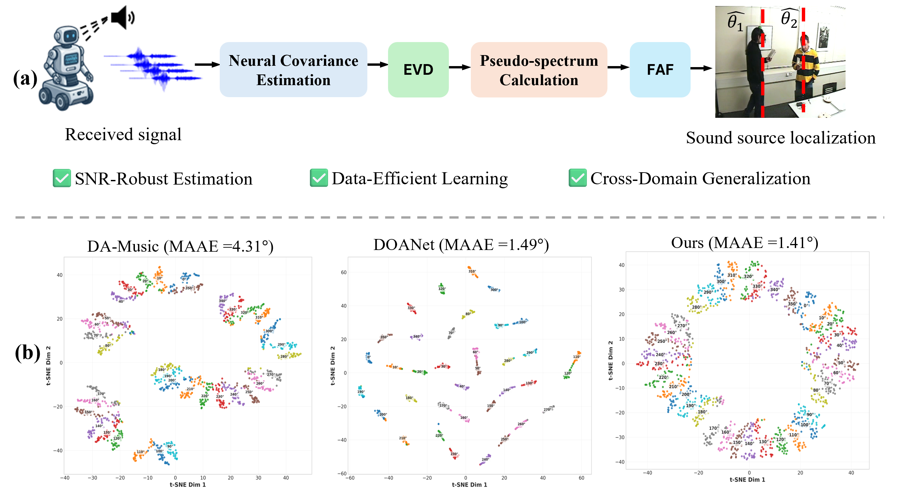

# NeuralMUSIC: A Hybrid Neural–Subspace Framework for Robust Robot Sound Source Localization (SSL)

This repository provides the official implementation of our paper on **NeuralMUSIC: A Hybrid Neural–Subspace Framework for Robust Robot Sound Source Localization (SSL)**.
We propose a hybrid neural–subspace framework that learns to estimate spatial statistics from multi-channel audio, and then leverages a classical subspace-based DOA estimator for robust direction-of-arrival inference with stronger generalization.

  

---
## Key Features
- **Hybrid neural–subspace framework** that combines deep learning with classical MUSIC-based DOA estimation.
- **Improved robustness** under noise and reverberation through learned spatial statistics.
- **Stronger generalization ability** across different acoustic environments and datasets.
- **Data efficiency** under limited training sample conditions.

---
## Notebook

All key usages are demonstrated in the provided notebook **`NeuralMusic.ipynb`**.

The notebook shows how to use the proposed model, reproduce the testing results, and provides detailed experimental settings for different datasets.

---
## Documentation
Further experimental results and additional implementation details are provided in the **`Additional_implementation_details.pdf`** directory.

