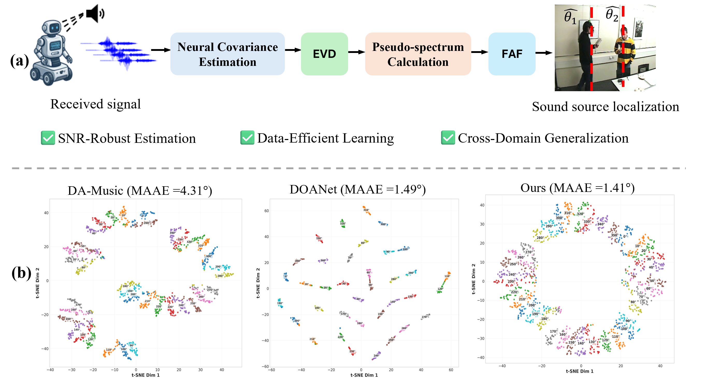

# NeuralMUSIC: A Hybrid Neural–Subspace Framework for Robust Robot Sound Source Localization (SSL)

This repository provides the official implementation of our paper on **NeuralMUSIC: A Hybrid Neural–Subspace Framework for Robust Robot Sound Source Localization (SSL)**.
We propose a hybrid neural–subspace framework that learns to estimate spatial statistics from multi-channel audio, and then leverages a classical subspace-based DOA estimator for robust direction-of-arrival inference with stronger generalization.

<p align="center">
  
</p>


---
## Key Features
- **Hybrid neural–subspace framework** that combines deep learning with classical MUSIC-based DOA estimation.
- **Improved robustness** under noise and reverberation through learned spatial statistics.
- **Stronger generalization ability** across different acoustic environments and datasets.
- **Data efficiency** under limited training sample conditions.

---
## Training and Testing

The repository now includes standalone training and testing entry points for the proposed NeuralMUSIC model.
Dataset paths are intentionally passed from the command line instead of hard-coded.

### Supervised DOA

```bash
python train_neuralmusic.py \
  --dataset gsc \
  --data-root /path/to/GSC_data \
  --save-dir checkpoints/neuralmusic_gsc \
  --num-sources 1 \
  --input-channel 8 \
  --batch-size 32 \
  --epochs 50 \
  --noise-aug
```

This trains the standard NeuralMUSIC model without source-count classification. To train the variant with a source-count classification head, add:

```bash
--estimate-num-sources --max-sources 4
```

Testing is shared by both supervised variants. Add `--estimate-num-sources` when evaluating a classification-head checkpoint.

```bash
python test_neuralmusic.py \
  --dataset gsc \
  --data-root /path/to/GSC_data \
  --checkpoint checkpoints/neuralmusic_gsc/best_model.pt \
  --num-sources 1 \
  --input-channel 8 \
  --save-dir results/neuralmusic_gsc
```

### Self-Supervised Reconstruction

Masked spectrogram reconstruction pretraining uses `NeuralMusic_pretrain`. The resulting checkpoint can initialize the supervised encoder with `train_neuralmusic.py --pretrain`.

```bash
python train_selfsupervised.py \
  --dataset gsc \
  --data-root /path/to/GSC_data \
  --save-dir checkpoints/neuralmusic_pretrain_gsc \
  --input-channel 8 \
  --batch-size 256 \
  --epochs 400 \
  --noise-aug
```

Reconstruction testing reports the masked weighted reconstruction loss and saves example reconstruction figures:

```bash
python test_selfsupervised.py \
  --dataset gsc \
  --data-root /path/to/GSC_data \
  --checkpoint checkpoints/neuralmusic_pretrain_gsc/best_model.pt \
  --input-channel 8 \
  --save-dir results/neuralmusic_pretrain_gsc
```

Supported dataset selectors are `gsc`, `soclas`, `afpild`, and `av16`. For AV16, use `--train-root` and `--val-root` instead of `--data-root`, and set `--mic-preset av16 --input-channel 32`.

## Notebook

Additional usage and visualization examples are demonstrated in **`NeuralMusic.ipynb`**.

For an end-to-end GSC smoke-test workflow covering self-supervised reconstruction and both NeuralMUSIC supervised variants, see **`NeuralMusic_GSC_Tests.ipynb`**.
---
## Documentation
Further experimental results and additional implementation details are provided in the **`Additional_implementation_details.pdf`**.
